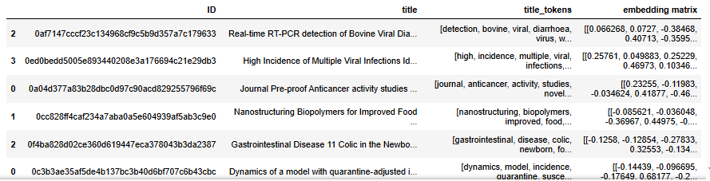

# COVID-19 Paper Analysis Project

## Project Overview

This project focuses on the analysis of academic papers related to COVID-19, SARS-CoV-2, and other coronaviruses. Using a subset of the COVID-19 Open Research Dataset Challenge (CORD-19), the project aims to extract meaningful insights from the literature through a series of computational tasks. The analysis begins with benchmarking to identify optimal parameters, followed by a full-scale analysis using these parameters on a dataset of approximately 1,000 papers.

## Authors

- **Sepideh Ghaemifar**
- **Mahdy Vatankhahan**
- **Abbas Zal**
- **Ehsan Eslami Shafigh**

## Project Assignment

### 1. Word Counter Distributed Algorithm

This task involved implementing a distributed algorithm to count the occurrences of all words across a collection of documents, where each document corresponds to the full text of an academic paper. This approach, common in Natural Language Processing (NLP), helps analyze the distribution of terms within a corpus.

- **Methodology**: The task was executed using the MapReduce framework, where:
  - **Map Phase**: Each document was split into words, and for each word, a count was generated.
  - **Reduce Phase**: The counts were aggregated across documents to produce the total word counts.

### 2. Country and University Representation

This task aimed to determine which countries and universities were most and least represented in the COVID-19 research papers. The analysis was based on the affiliation data of the authors.

### 3. Title Embedding

This task focused on converting the titles of the research papers into vector embeddings—a common NLP technique that transforms text into a set of vectors representing the words.

- **Methodology**: 
  - We used a pre-trained word embedding model from FastText to obtain vector representations for each word in the title.
  - The following code snippet was used to load the pre-trained model:
    ```python
    import io

    def load_vectors(fname):
        fin = io.open(fname, 'r', encoding='utf-8', newline='\n', errors='ignore')
        n, d = map(int, fin.readline().split())
        data = {}
        for line in fin:
            tokens = line.rstrip().split(' ')
            data[tokens[0]] = list(map(float, tokens[1:]))
        return data

    model = load_vectors('wiki.en.vec')
    ```
  - Each paper's title was then transformed into its corresponding embedding vector.

### 4. Cosine Similarity

The final task was to compute the cosine similarity between the vector representations (embeddings) of paper titles. Cosine similarity measures the similarity between two vectors, reflecting how closely related the titles of different research papers are.

## Project Structure

The project is organized into several key components:

- **Distributed Systems**: The project leverages distributed systems to efficiently handle large-scale data processing tasks. This involves setting up and managing clusters of machines that work together to process data in parallel, reducing computation time and increasing scalability.

- **Dask**: We utilize Dask, a flexible parallel computing library, for efficient execution of our tasks. Dask allows us to work with large datasets by parallelizing computations, providing support for multi-machine clusters, and offering data structures such as Dask Bags, DataFrames, and Arrays optimized for distributed computing.

- **Benchmarking**: Each computational task begins with a benchmarking process to determine the best parameters for the analysis. These benchmarks are performed on smaller subsets of the data to ensure optimal performance when scaling up to the full dataset.

- **Full Analysis**: After benchmarking, the best-performing parameters are applied to run the complete analysis on the entire dataset of 1,000 papers.

## Dataset

The dataset used in this project is derived from the COVID-19 Open Research Dataset Challenge (CORD-19). This dataset is part of a global effort to consolidate and analyze academic literature on COVID-19. It includes a wide array of papers focusing on various aspects of the virus, its transmission, treatment, and related topics.

- **Dataset Source**: [CORD-19 on Kaggle](https://www.kaggle.com/allen-institute-for-ai/CORD19-research-challenge)
- **Subset Used**: A selection of approximately 1,000 papers from the larger CORD-19 dataset.

## Data Structure

The documents in our dataset are structured as follows:

```json
{
  "paper_id": "<str>",  # 40-character SHA1 of the PDF
  "metadata": {
    "title": "<str>",
    "authors": [          # List of author dictionaries, in order
      {
        "first": "<str>",
        "middle": ["<str>", ...],  # List of middle names or initials
        "last": "<str>",
        "suffix": "<str>",
        "affiliation": {
          "laboratory": "<str>",
          "institution": "<str>",
          "location": {
            "settlement": "<str>",
            "country": "<str>"
          }
        },
        "email": "<str>"
      }
    ]
  },
  "abstract": [          # List of paragraphs in the abstract
    {
      "text": "<str>",
      "cite_spans": [    # List of citation spans
        {
          "start": <int>,
          "end": <int>,
          "text": "<str>",
          "ref_id": "<str>"
        }
      ],
      "ref_spans": [     # List of reference spans
        {
          "start": <int>,
          "end": <int>,
          "text": "<str>",
          "ref_id": "<str>"
        }
      ],
      "section": "<str>"
    }
  ],
  "body_text": [         # List of paragraphs in the full body
    {
      "text": "<str>",
      "cite_spans": [],
      "ref_spans": [],
      "eq_spans": [],   # Equation spans, if applicable
      "section": "<str>"
    }
  ]
}
```

## Results
1. Word Count Analysis
The distributed word count algorithm was applied to the full dataset of approximately 1,000 academic papers. The most frequently occurring words were identified, revealing key terms related to COVID-19, such as "Cells" , "virus," "infection," and "pandemic." These terms reflect the primary focus areas of the research papers in the dataset.

### Word Count Analysis


2. Country and University Representation
Our analysis of author affiliations provided insights into the global research landscape on COVID-19. The countries and universities with the highest representation in the dataset were identified, highlighting regions and institutions that are heavily involved in COVID-19 research. Conversely, regions with lower representation were also noted, suggesting areas where research output might be less concentrated.

### The countries and universities with the highest representation


3. Title Embedding and 4.Cosine Similarity
Using pre-trained FastText embeddings, we converted the titles of the research papers into vector representations. We then computed the cosine similarity between these vectors to assess how closely related the paper titles were.

### Embedding



Key Findings:
Most Similar Papers: The pair of papers with the highest cosine similarity score shared extremely close thematic content, as reflected in their titles. The maximum similarity score was 0.96, with the following titles:

### Title 1: [Cross-reactivity of antibody against SARS-coronavirus nucleocapsid protein with IL-11]
### Title 2: [The SARS-CoV nucleocapsid protein: A protein with multifarious activities]


Least Similar Papers: Conversely, the papers with the lowest similarity score had very distinct topics. The minimum similarity score was 0.36, with the following titles:

### Title 1: [Disassembly of the cystovirus /6 envelope by montmorillonite clay]
### Title 2: [Avian and human influenza virus compatible sialic acid receptors in little brown bats OPEN]
These findings highlight the thematic diversity within the dataset, as well as the areas of overlap in research topics.


